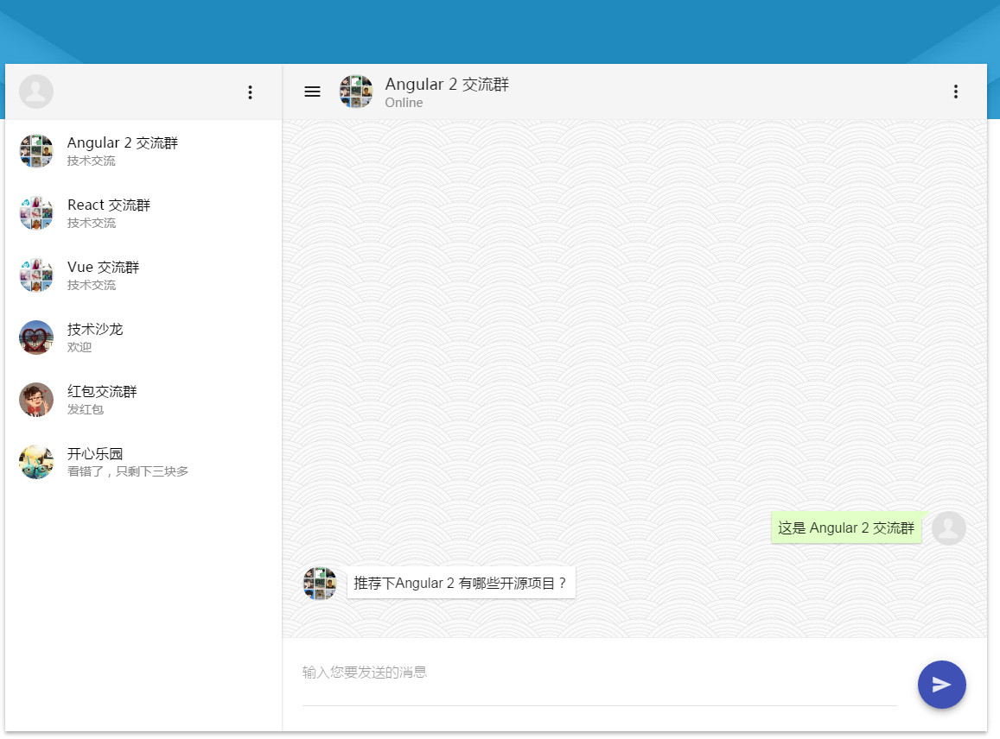

# web chat app

聊天应用

### 介绍

该项目使用 material2 模块进行开发

### 快速使用

`npm install -g @angular/cli@latest`

`ng serve`

### 依赖包

[@angular/material](https://github.com/angular/material2)

[flex-layout](https://github.com/angular/flex-layout)

[angular-in-memory-web-api](https://github.com/angular/in-memory-web-api)

[angular2-perfect-scrollbar](https://www.npmjs.com/package/angular2-perfect-scrollbar)

### 关联项目

[angular2-material2-bootstrap4-admin-app](https://github.com/stbui/angular2-material2-bootstrap4-admin-app.git)
